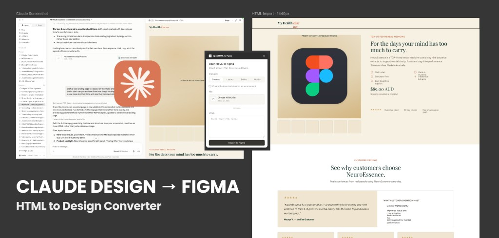
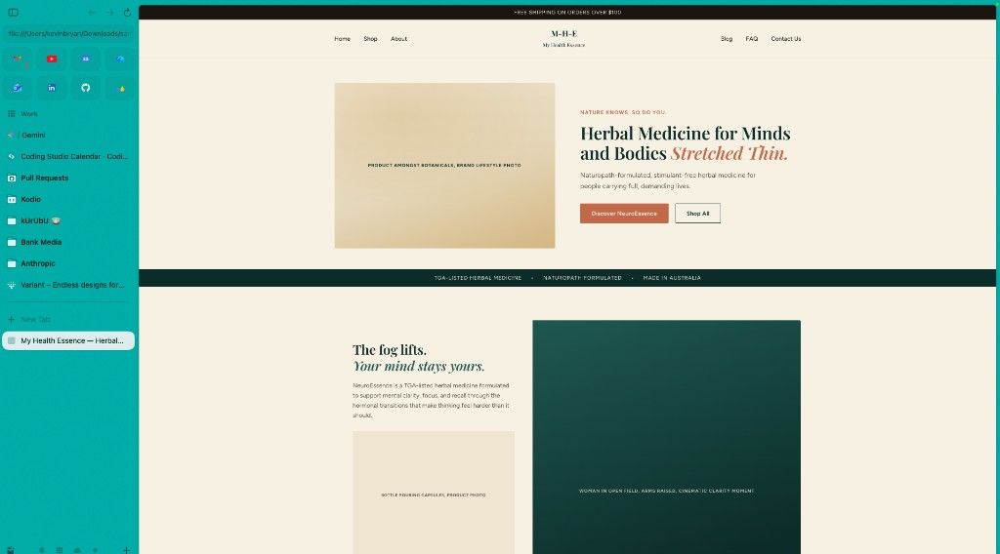
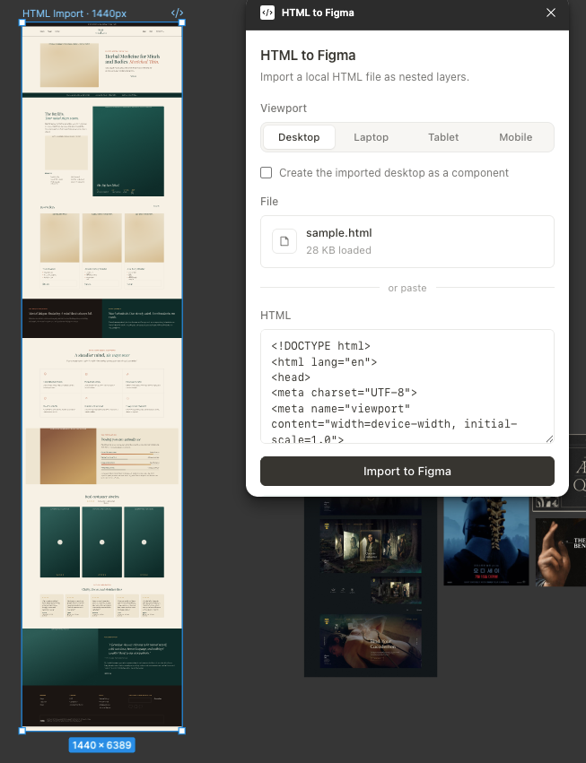

# Open HTML to Figma

<p align="center">
  
</p>

Open-source Figma plugin: turn a **local HTML file** into nested, editable layers that match the rendered page.

No URL crawling. No subscription. The browser lays it out; Figma gets matching Frames and Text.

If this saves you time, [★ star the repo](https://github.com/kevicebryan/open-htmltofigma) — it helps others find it.

<p align="center">
  
  &nbsp;
  
</p>
<p align="center"><em>Browser → Figma import</em></p>

## Quick start

**Needs:** [Figma desktop](https://www.figma.com/downloads/) + Node 18+

```bash
git clone https://github.com/kevicebryan/open-htmltofigma.git
cd open-htmltofigma
npm install && npm run build
```

1. Figma → **Plugins → Development → Import plugin from manifest…** → `manifest.json`
2. Run **Open HTML to Figma**
3. Pick a viewport → upload/paste HTML → **Import to Figma**

## What you get

| HTML | Figma |
|------|--------|
| Structure, flex/grid layout | Nested Frames at measured positions |
| Colors, gradients, asymmetric radii, shadows | Fills / strokes / effects |
| LTR and RTL text | Direction-aware editable Text layers |
| SVG | Editable vectors with computed colors, rotation, opacity, and brightness |
| Images / complex backgrounds | Correctly fitted image fills; selective raster fallback when needed |

**Closer match:** use a full document with inline CSS, install page fonts in Figma, and choose the matching viewport preset. Mobile capture uses a `390 × 844` viewport so fixed-height app screens and viewport units are measured predictably. Try [`examples/`](examples/).

After each import, the plugin reports vector SVGs, raster fallbacks, approximated SVGs, and substituted font families. Treat substitutions as a signal to install the requested font before comparing visual fidelity.

**JS-rendered pages** (content built by an inline `<script>`, not present in the raw HTML): tick **Execute page scripts** before importing. Off by default — only enable it for HTML you trust, since it lets the page’s own script run.

## How it works

```
HTML → isolated browser layout → measure DOM → Frames / Text / images in Figma
```

Absolute positions from real layout (not Auto Layout rewrite). That’s intentional for visual parity.

## Fidelity behavior

The converter favors editable native Figma layers. It resolves logical `start` / `end` text alignment from each element's computed direction, protects browser-single-line text from Figma rewrapping, and preserves individual corner radii. Supported inline SVGs remain vectors; unsupported visual backgrounds are rasterized at the smallest useful subtree.

## Limits

Font substitution if faces aren’t in Figma; complex 3D transforms, masks, animations, and some multi-layer CSS paints; CORS-restricted images; mixed inline text styles. Supported opacity, brightness, layer blur, and backdrop blur are translated to Figma effects. Unsupported looks fall back to a local raster instead of disappearing and are reported after import.

## License

MIT — see [LICENSE](LICENSE).
