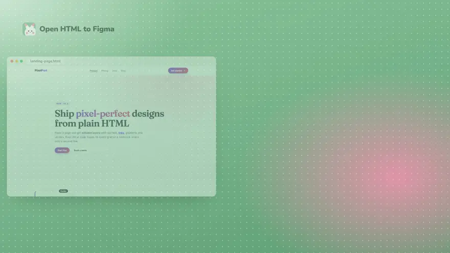
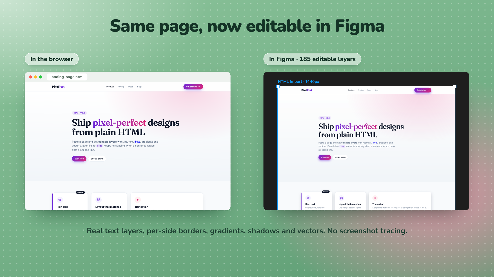
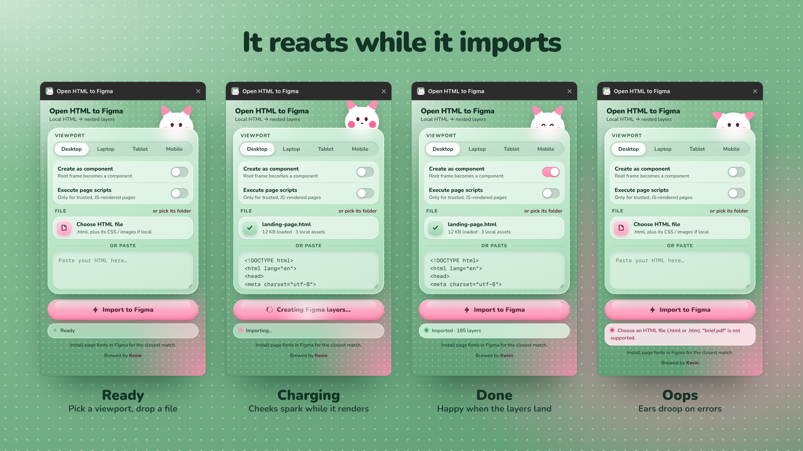

<p align="center">
  
</p>

<h1 align="center">Open HTML to Figma</h1>

<p align="center">
  Turn a <b>local HTML file</b> into editable Figma layers that match what the browser renders.<br />
  Free and open source. No account, no subscription, no URL crawling.
</p>

<p align="center">
  <a href="#quick-start">Quick start</a> ·
  <a href="#using-it">Using it</a> ·
  <a href="#how-it-works">How it works</a> ·
  <a href="docs/demo.mp4">Demo video</a> ·
  <a href="https://github.com/kevicebryan/open-htmltofigma">★ Star the repo</a>
</p>

<p align="center">
  <a href="docs/demo.mp4"></a>
</p>

## Browser in, Figma layers out

The browser does the layout. The plugin measures the rendered page and rebuilds it as nested Frames, rich-text layers, vectors and image fills, so you can keep designing instead of redrawing.

<p align="center">
  
</p>
<p align="center"><em><a href="examples/kitchen-sink.html"><code>examples/kitchen-sink.html</code></a> in Chrome (left) and after import (right): 185 editable layers.</em></p>

## Quick start

**Needs:** [Figma desktop](https://www.figma.com/downloads/) and Node 18+

```bash
git clone https://github.com/kevicebryan/open-htmltofigma.git
cd open-htmltofigma
npm install && npm run build
```

1. In Figma: **Plugins → Development → Import plugin from manifest…** and pick `manifest.json`
2. Run **Open HTML to Figma**
3. Pick a viewport, add your HTML, then **Import to Figma**

## Using it

<p align="center">
  
</p>

| Step | What to do |
| --- | --- |
| **Viewport** | Desktop (1440 × 1024), Laptop (1280 × 832), Tablet (768 × 1024) or Mobile (390 × 844). Media queries and `vh` units resolve against it. |
| **File** | Choose an `.html` file. If it uses local CSS, images or fonts, select them together with the page, or use **or pick its folder**, so relative `href` / `src` / `url()` references resolve. |
| **Or paste** | Paste HTML straight into the text box. |
| **Create as component** | The imported root becomes a Component instead of a Frame. |
| **Execute page scripts** | For JS-rendered pages (Tailwind Play CDN, content built by a `<script>`). Entrance and scroll-reveal animations are settled before measuring. Off by default; only enable it for HTML you trust. |

The import lands in the middle of your viewport, selected and zoomed to fit. It is named `HTML Import · 1440px` (or `HTML Component · …`), and up to 40 of its colors are added as local color styles under `HTML/`.

**Closer match:** import at the viewport you design at, and install the page's fonts in Figma. Fonts Figma doesn't have are substituted and listed after the import.

## What you get

| HTML | Figma |
| --- | --- |
| Flex / grid / absolute layout, `vh` units | Nested Frames at the measured positions |
| Paragraphs with `<b>`, `<i>`, links, inline `<code>` | One editable rich-text layer each, same line breaks as the browser |
| Solid, linear, radial and `background-clip: text` gradients | Native fills |
| Per-side borders, per-corner radii, shadows, rings, `blur()`, `backdrop-filter` | Strokes, corner radii and effects |
| Inline SVG, `<use>` sprites, `` | Vector layers |
| Images, `background-image`, `<canvas>` charts | Image fills cropped like `object-fit` / `background-size` |
| `::before` / `::after`, list markers, form controls, `rotate()` | Matching layers |

Try the pages in [`examples/`](examples/): `kitchen-sink.html` covers most features, and `tailwind-cdn.html` needs **Execute page scripts**.

## How it works

```
HTML → isolated browser render at your viewport → measure the DOM → Frames / Text / vectors / images in Figma
```

1. The plugin UI ([`ui.html`](ui.html)) renders your page in a sandboxed iframe sized like a real window, waits for fonts and images, and settles animations.
2. It walks the DOM and records each box's geometry, paints, borders, radii, shadows and text runs, including where the browser broke lines.
3. The main thread ([`code.ts`](code.ts)) resolves fonts and rebuilds the tree as Figma nodes with the same positions.

Positions are absolute, straight from the browser's layout, instead of being rewritten as Auto Layout. That's intentional: it keeps the import visually identical. More detail in [ARCHITECTURE.md](ARCHITECTURE.md).

## Privacy

- Everything runs inside Figma: there is no backend, account, analytics or tracking, and the plugin stores nothing.
- The only network requests are the ones your page makes while it renders (its stylesheets, scripts, fonts and images). Nothing from your Figma file is sent anywhere.
- The plugin UI itself makes no requests; its typeface is bundled.
- `manifest.json` allows every domain only because pages can reference any CDN.

## Limits

Missing fonts are substituted, and Figma's copy of a web font can be slightly wider or narrower (optical sizes); line breaks are kept either way. Skew, 3D transforms, `clip-path` and masks keep the measured box, not the effect. Conic / repeating gradients and HTML inside SVG become images. Cross-origin iframes are placeholders.

## Development

| Path | What it is |
| --- | --- |
| [`ui.html`](ui.html) | Plugin UI: file handling, the isolated render, DOM capture and asset rasterizing |
| [`code.ts`](code.ts) | Figma main thread: builds nodes from the captured tree. `npm run build` compiles it to `code.js` |
| [`manifest.json`](manifest.json) | Plugin entry points and network access |
| [`test/check.html`](test/check.html) | Runs the real capture on `examples/kitchen-sink.html` and asserts the tree |
| [`docs/`](docs/) | Logo, icon and promo images; `promo.html`, `demo.html` and `record.mjs` regenerate them |

```bash
npm run watch                      # rebuild code.js on change
python3 -m http.server 8765        # then open http://localhost:8765/test/check.html
node docs/record.mjs               # re-record docs/demo.mp4 (needs Chrome + ffmpeg, server running)
```

After changing the capture, run `test/check.html`, then import the files in `examples/` in Figma desktop.

## License

MIT, see [LICENSE](LICENSE). Brewed by [Kevin](https://www.linkedin.com/in/bryan-kevin/).
